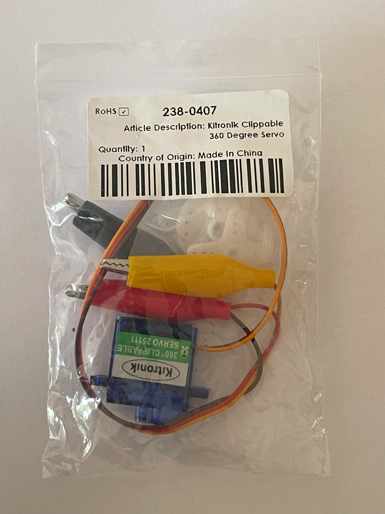

## 2. Motors

|Name |Supplier|Stock Number|
|-|-|-|
|1. Right Angle Geared DC Motor (Yellow) |RS|215-3179|
|2. DC Motor (Grey)|RS|215-3176|
|3. 180° Servo Motor|RS|215-3180|
|4. 360° Servo Motor|RS|238-0407|
|5. 5V Stepper Motor|RS|107-010|

### 1. Right Angle Geared Motor (Yellow)

**Voltage range**
: 3-6V

**Datasheet**
: [Right Angle Geared Motor (Yellow) Datasheet](https://docs.rs-online.com/43dd/A700000007388281.pdf)

**Pin Out**
**Note** The terminals of the motor will need to be soldered to wire before use  

### 2. DC Motor (Grey)

**Voltage Range**
: 1.5 to 4.5V

**Datasheet**
: [DC Motor (Grey) Datasheet](https://docs.rs-online.com/ac24/A700000007388305.pdf)

**Pin Out** 
Note The terminals of the motor will need to be soldered to wire before use

### 3. 180° Servo Motor

**Voltage Rnge**
:  4.8V - 6V

**Datasheet**
: [180° Servo Motor Datasheet](https://docs.rs-online.com/d7b7/A700000007388289.pdf)

**Pin Out**  

### 4. 360° Servo Motor

**Voltage Range**
: 4.8V - 6V

**Datasheet**
: [360° Servo Motor Datasheet](https://docs.rs-online.com/f4b2/A700000008500241.pdf)

**Pin Out**  

### 5. 5V Stepper Motor

**Voltage Range**
: 5V

**Datasheet**
[5V Stepper Motor Datasheet](https://docs.rs-online.com/be99/A700000011732010.pdf)

## 3. Output Devices

|Name |What it Does|Supplier|Stock Number|
|-|-|-|-|
|1. RGB LED |Emits light in different colours|RS|254-5727|

### 1. RGB LED

**Voltage range**
: 2V

**Datasheet**
: [RGB LED Datasheet](https://docs.rs-online.com/f9a8/A700000009318027.pdf)

**Pin Out**
: [Ref.](https://www.circuitbread.com/tutorials/how-rgb-leds-work-and-how-to-control-color)

**Useful Websites**
: [How to use](https://www.instructables.com/Demystifying-4-pin-RGB-LEDS-Radio-Shack-276-0028/)  

