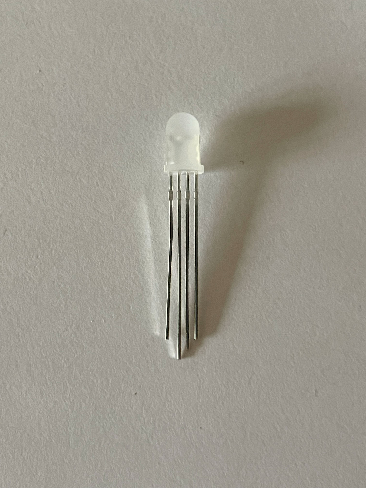

# Actuators

|Name |What It Does | Supplier|Stock Number|
|-|-|-|-|
|[Right Angle Geared DC Motor (Yellow)](#right-angle-geared-motor-yellow) |Motor that continuously turns with integrated gearbox |RS|215-3179|
|[DC Motor (Grey)](#dc-motor-grey)|Motor that continuously turns without gearbox|RS|215-3176|
|[180° Servo Motor](#180-servo-motor)|Motor that rotates to specifc location within 180°| RS|215-3180|
|[5V Stepper Motor](#5v-stepper-motor)|Motor that continously turns with control| RS|107-010|
|Mini Solenoid | | | |
|H Bridge Driver | | | |
|[RGB LED](#rgb-led) |Emits light in different colours|RS | 254-5727|

## Right Angle Geared Motor (Yellow)

**Voltage range**
: 3-6V

**Datasheet**
: [Right Angle Geared Motor (Yellow) Datasheet](https://docs.rs-online.com/43dd/A700000007388281.pdf)

**Pin Out**
**Note** The terminals of the motor will need to be soldered to wire before use.  

## DC Motor (Grey)
  

**Voltage Range**
: 1.5 to 4.5V

**Datasheet**
: [DC Motor (Grey) Datasheet](https://docs.rs-online.com/ac24/A700000007388305.pdf)

**Pin Out** 
Note The terminals of the motor will need to be soldered to wire before use.

## 180° Servo Motor

**Voltage Rnge**
:  4.8V - 6V

**Datasheet**
: [180° Servo Motor Datasheet](https://docs.rs-online.com/d7b7/A700000007388289.pdf)

**Pin Out**  

## 5V Stepper Motor
  

**Voltage Range**
: 5V

**Datasheet**
[5V Stepper Motor Datasheet](https://docs.rs-online.com/be99/A700000011732010.pdf)

## RGB LED
 

**Voltage range**
: 2V

**Datasheet**
: [RGB LED Datasheet](https://docs.rs-online.com/f9a8/A700000009318027.pdf)

**Pin Out**
: [Ref.](https://www.circuitbread.com/tutorials/how-rgb-leds-work-and-how-to-control-color)

**Useful Websites**
: [How to use](https://www.instructables.com/Demystifying-4-pin-RGB-LEDS-Radio-Shack-276-0028/)  

