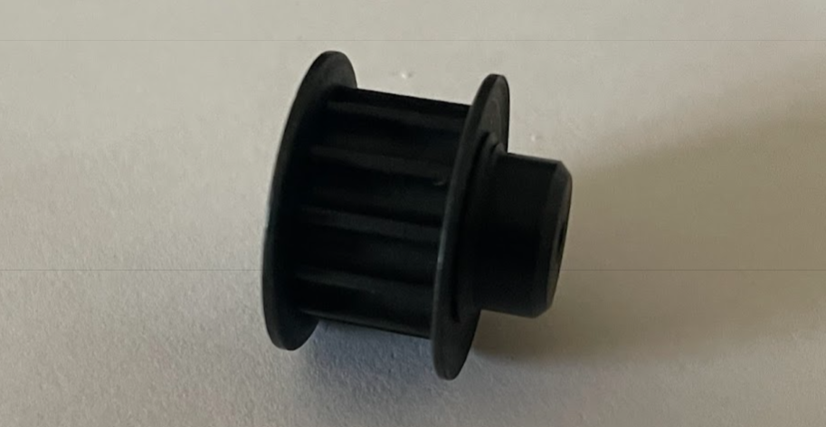

## 5. Mechanical Parts

|Name |Supplier|Stock Number|
|-|-|-|
|1. Magnets|RS|219-2257|
|2. Bearings|RS|261-2600|
|3. Gear Kit |RS|337-683|
|4. Pulley|RS|236-5391|

### 1. Magnets

Dimensions:  
3mm Diameter  
1mm Thickness

**Datasheet**
: [Magnets Datasheet](https://uk.rs-online.com/web/p/neodymium-magnets/2192257?gb=s)

### 2. Bearings

**Datasheet**
: [Bearing Datasheet](https://docs.rs-online.com/f380/A700000009560732.pdf)

### 3. Gear Kit

**Datasheet**
: [Gear Kit Datasheet](https://docs.rs-online.com/8195/0900766b800bd7b1.pdf)

**Useful Websites**
: [Basic Gear Mechanisms](https://www.instructables.com/Basic-Gear-Mechanisms/)

### 4. Pulley

Should be used with a belt of the correct dimentions:  
9mm Belt Width  
5mm Pitch

**Datasheet**
: [Pulley Datasheet](https://uk.rs-online.com/web/p/belt-pulleys/2365391?gb=s)

**Useful Websites**
: [Belt Length Calculator](https://sudenga.com/resources/figuring-belt-lengths-and-distance-between-pulleys/)
