## Sensors

|Name |What it Senses |Supplier|Stock Number|
|-|-|-|-|
|Reflective photosensor |Light reflectance|RS|124-6800|
|Linear Hall Effect |Magnetic field  |RS|753-2002|
|Tactile Switch |Momentary pressing |RS|161-3779|
|Toggle Switch|Holds position |RS|448-0747|
|Optical Switch || RS|219-2533 & 708-5547|
|10kΩ Potentiometer|Rotary dial |RS|729-3599|

### 1. Reflective photosensor
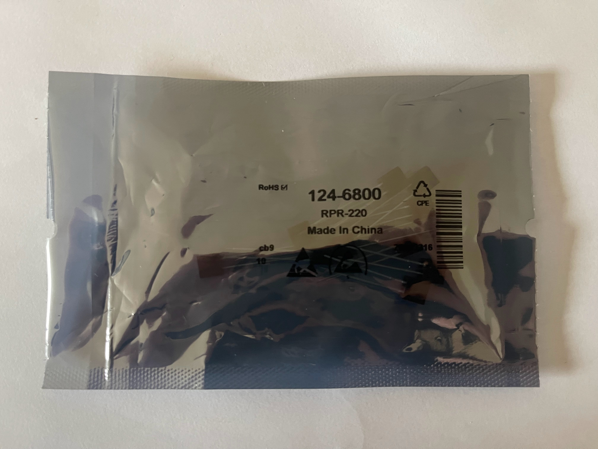
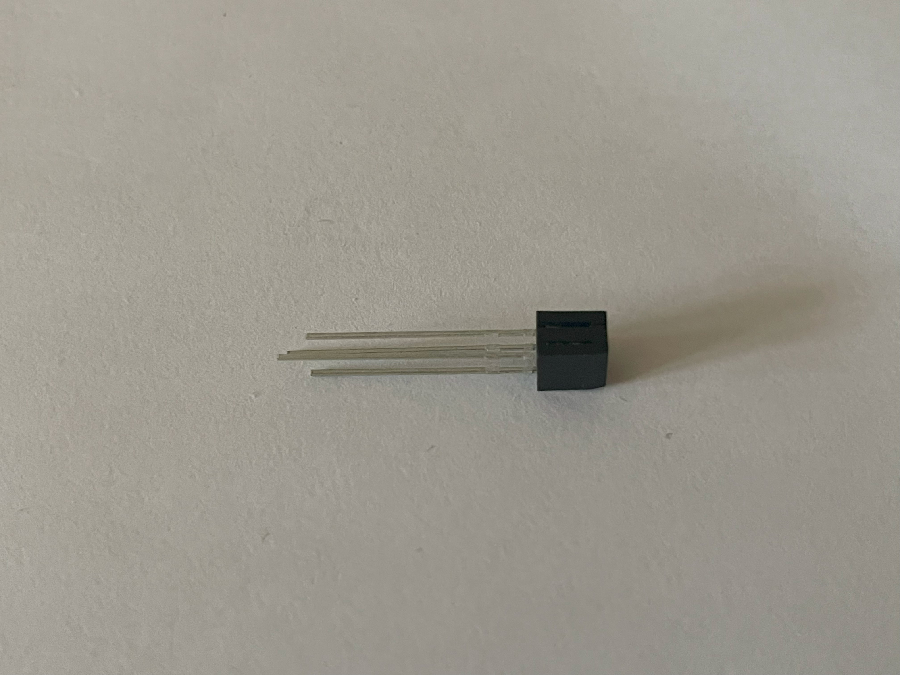

**Voltage range**
: 1.34V

**Datasheet**
: [Reflective photosensor Datasheet](https://docs.rs-online.com/52cd/0900766b81539a4a.pdf)

<!-- **Pin Out**
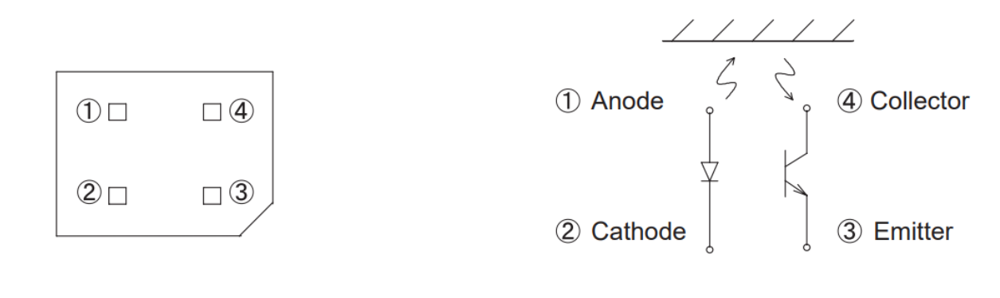 -->

### 2. Linear Hall Effect Sensors
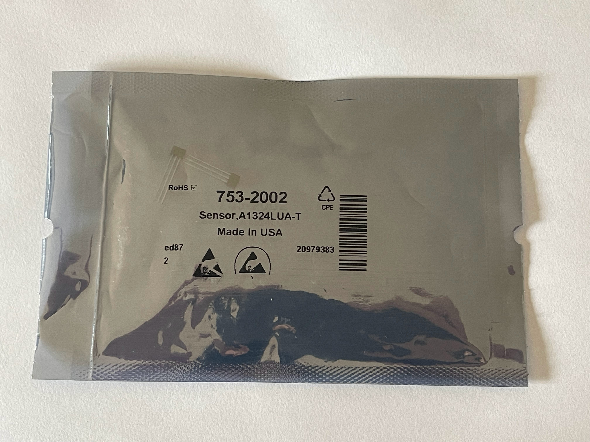
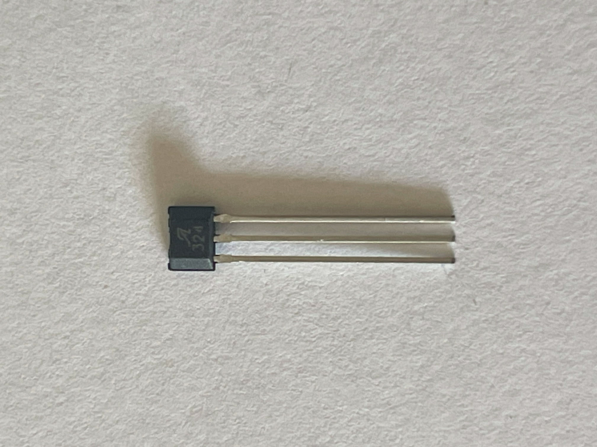

Hall effect sensors detect the strength and direction of a magnetic field.

**Voltage range**
: 5V

**Datasheet**
: [Linear Hall Effect Sensor Datasheet](https://docs.rs-online.com/e64f/0900766b8106a158.pdf)

## 4. Buttons and Potentiometers

### 1. Tactile Switches
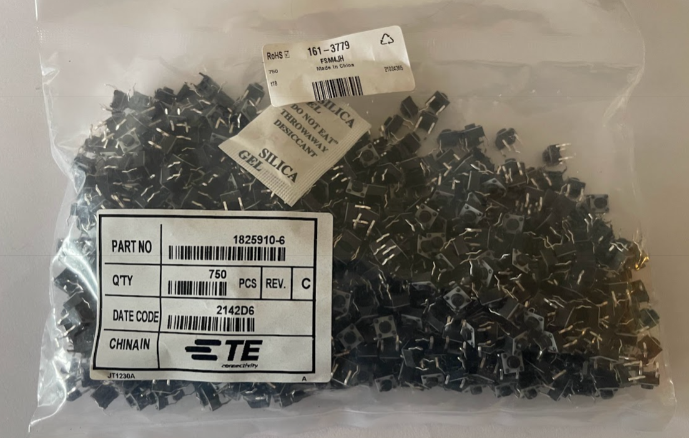

**Voltage range**
: <24V

**Datasheet**
: [Tactile Switch Datasheet](https://docs.rs-online.com/e4fd/A700000009237051.pdf)

**Pin Out**
: [Using Tactile Switches](https://www.sameskydevices.com/blog/tactile-switches-101#:~:text=Tactile%20switches%20typically%20contain%204,in%20a%20very%20small%20package.)

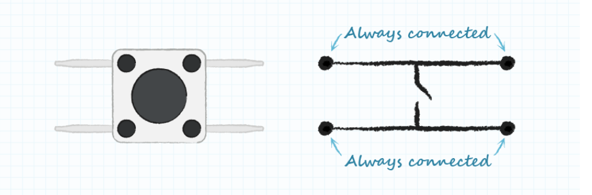
### 2. Toggle Switches
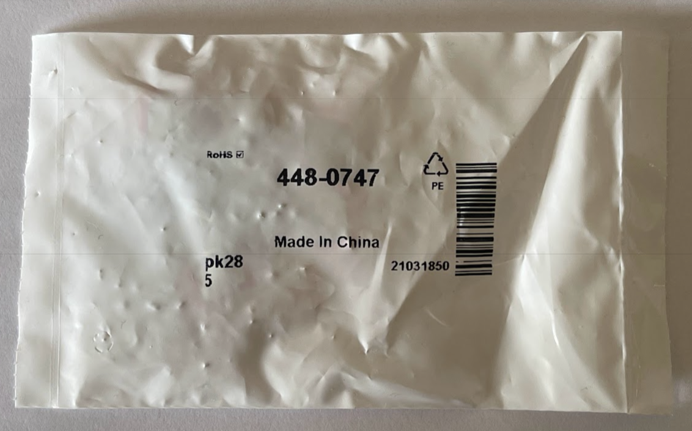
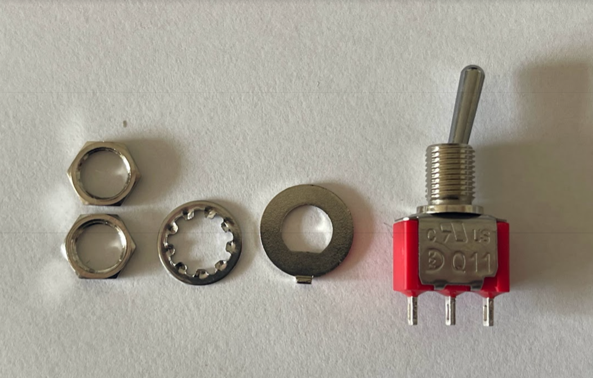

**Voltage range**
: <28V

**Datasheet**
: [Toggle Switch Datasheet](https://docs.rs-online.com/4727/0900766b8158554d.pdf)

**Pin Out**
: [Toggle Switch Wiring](https://www.learningaboutelectronics.com/Articles/Toggle-switch-wiring.php)

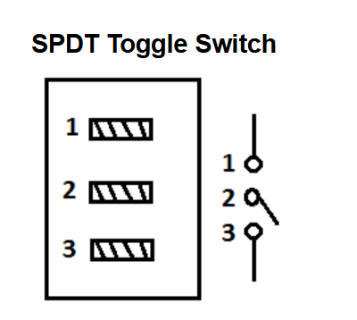

### 3. Optical Switches
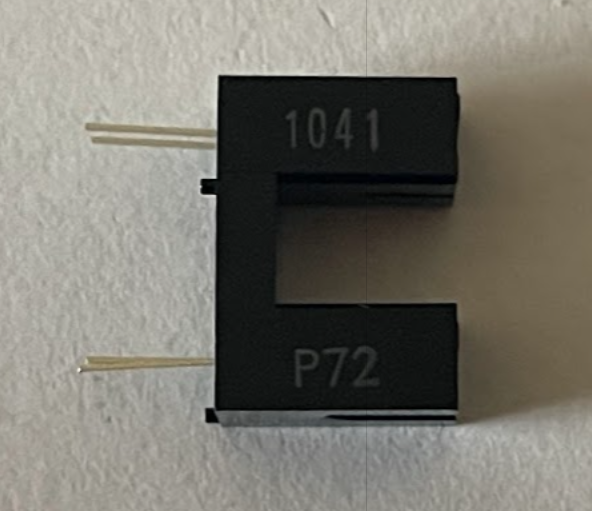
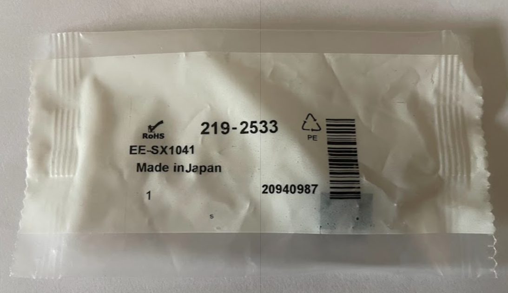
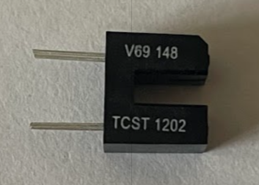
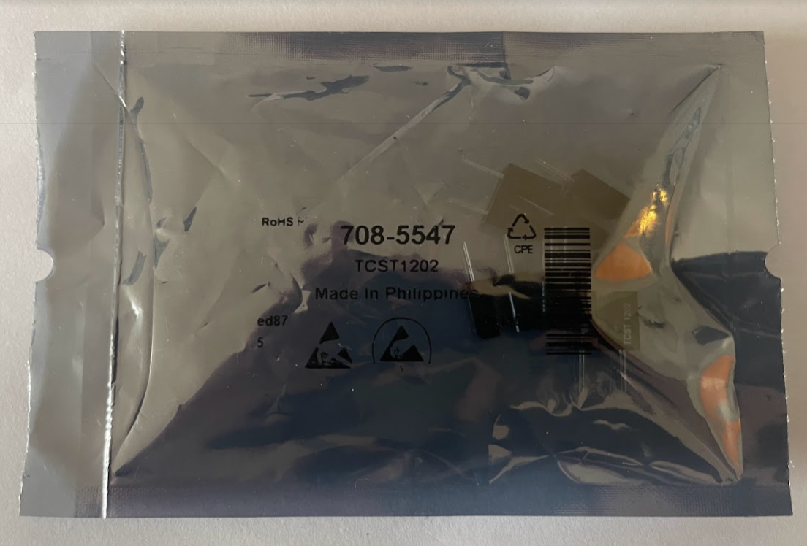

**Voltage range**
: 5V

**Datasheet**
: [Optical Switch (TCST 1202) Datasheet](https://docs.rs-online.com/80d3/0900766b80e30951.pdf)  
[Optical Switch (P72) Datasheet](https://docs.rs-online.com/bb59/0900766b8151e488.pdf)

**Pin Out**

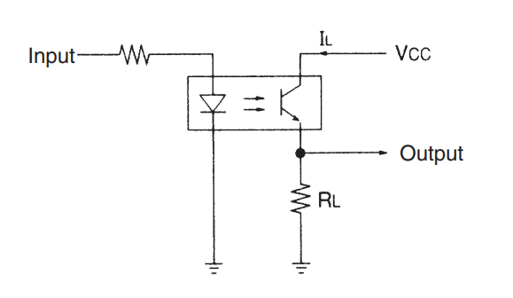

### 4. 10kΩ Potentiometer
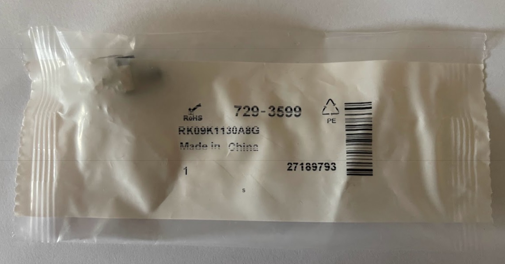
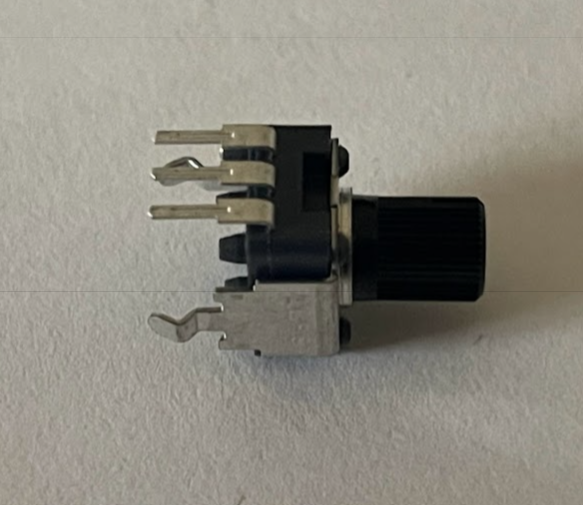

**Voltage range**
: <50V

**Datasheet**
: [10kΩ Potentiometer Datasheet](https://docs.rs-online.com/06f8/0900766b80f4c571.pdf)  

**Pin Out**
[What is a Potentiometer?](https://www.etechnophiles.com/what-is-a-potentiometer/#google_vignette)

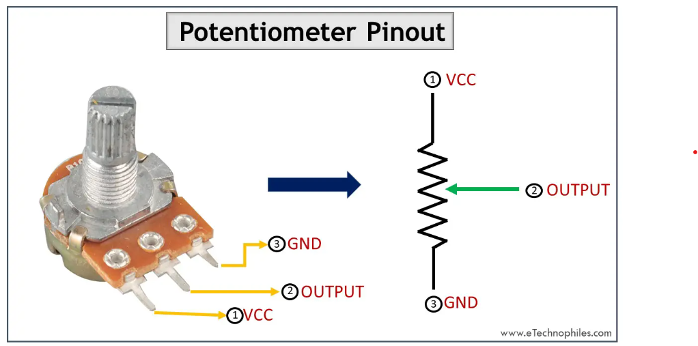

